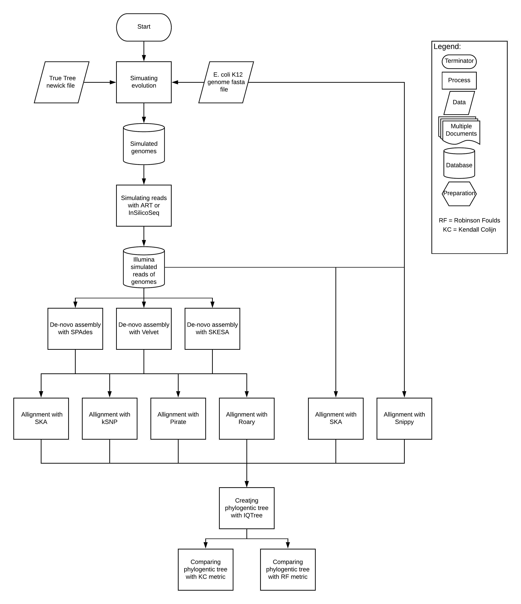
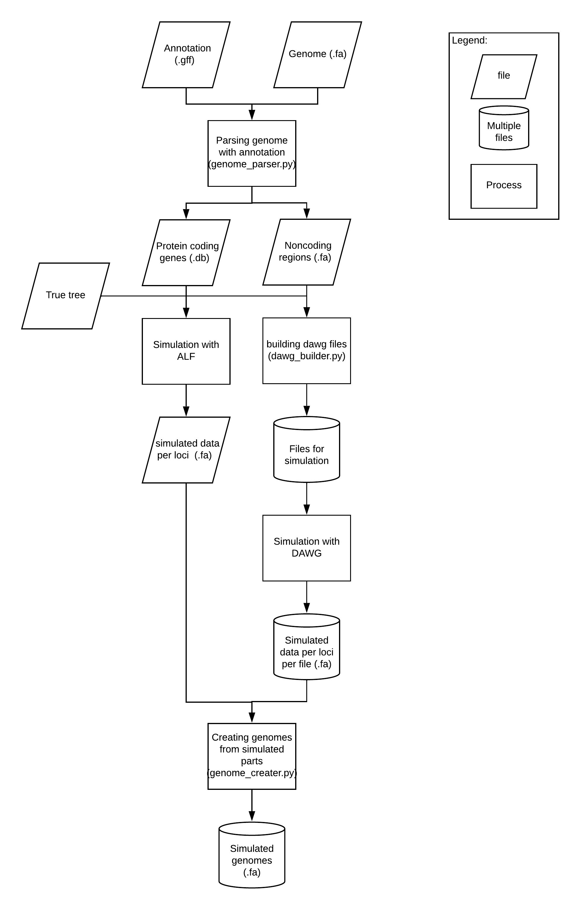

# Phylogenetic workflow
Benchmarkig phylogenetic workflows for E.coli K12 whole genome

## flowchart of the whole workflow

## flowchart of the simulation workflow in detail

## Authors
Authors:
- Niek Huijsmans
- Boas van der Putten

Contributers:
- Daniel Mende

## License

- **[MIT license](http://opensource.org/licenses/mit-license.php)**
