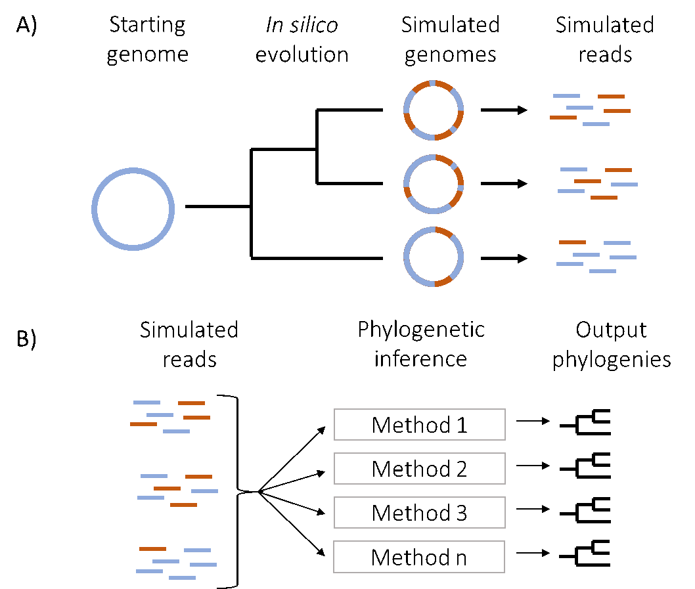

# Benchmarkig phylogenetic workflows for E.coli K12 whole genome #
## Summary ##
Nowadays it is more than obvious that genomic epidemiology is of great importance to achieve public health. Phylogenetic workflow is the foundation and first step for understanding whole genome sequence data from bacterial populations. The methods for phylogenetic reconstruction is complex and are often based of usability, rather than the ability to answer the biological question. Therefore it is desirable to search the golden method for phylogenetic workflows. Hitherto simulating of genomes is considered the most appropriate approach to benchmark phylogenetic workflows and eventually conclude the golden method. 

## Usage ##
### Parsing genome into IGR and CDS ###
```
snakemake -j <threads> --use-conda -f Snakefile_parse
```
### Simulating genome and reads ###
```
snakemake -j <threads> --use-conda -f Snakefile_simulation
```
### Phylogentic workflows ###
```
snakemake -j <threads> --use-conda -f Snakefile_phylogenetic
```
## Overview ##


*Fig 1. Schematic overview. A) A starting genome is in silico evolved into multiple simulated genomes following a defined phylogeny. Different settings are used in the in silico evolution to test phylogenetic reconstruction across a range of parameters. Reads are simulated from the simulated genomes. B) Multiple phylogenetic reconstruction methods is performed on the simulated reads. The resulting phylogenies are compared with the defined phylogeny in panel A, to assess how well the phylogenetic reconstruction method performed.*

## flowchart of the whole workflow ##


## flowchart of the simulation workflow in detail ##


## Authors ##
### Authors: ###
- Niek Huijsmans
- Boas van der Putten

### Contributers: ###
- Daniel Mende

## License

[](http://badges.mit-license.org)

- **[MIT license](http://opensource.org/licenses/mit-license.php)**
